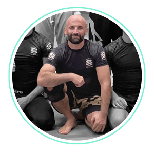
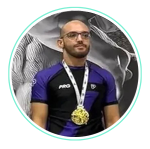

---
layout:  /src/layouts/ProjectLayout.astro
title: 'Grappling'
pubDate: 2025-09-01
description: 'Corso di Grappling e Brazilian Jiujitsu'
skills: ["standing", "Takedown"]
image:
  url: "/images/projects/judo/grappling-card-image.jpg"
  alt: "grappling besana discipline"
--- 

Il corso di **Grappling** (o Brazilian Jiu-jitsu) è al cuore della nostra scuola. I corsi sono tenuti da <a href="https://www.instagram.com/bjj_marcobex/" target="blank">Marco Beccari</a>, cintura nera col grado di **Maestro** nel Brazilian Jiu-Jitsu, riconosciuto da FIJLKAM/CONI e Unione Italiana Jiu-jitsu.

## 👨‍🏫 I Coach di Grappling

Il coach di Grappling Besana è <a href="https://www.instagram.com/bjj_marcobex/" target="blank">Marco Beccari</a>, cintura nera col grado di **Maestro** nel Brazilian Jiu-Jitsu, riconosciuto da FIJLKAM/CONI e Unione Italiana Jiu-jitsu. Ha conseguito la cintura nera nel giugno 2022 in una delle più blasonate accademie della Brianza. Pratica BJJ dal 2014 ed è anche una cintura nera di Judo, che ha praticato per molti anni fin dalle scuole medie.

Tra i risultati agonistici più significativi:
<ul>
<li>2022 Roma: 🥇 Oro Europeo Master 3 IBJJF - Cinture Marroni</li>
<li>2022 Luxembourg: 🥇 Oro No-gi Master NAGA - Cinture Nere</li>
<li>2019 Barcellona: 🥇 Oro Europe Master Open IBJJF - Cinture Viola</li>
<li>2019 Firenze: 🥇 Oro Italiano Gi Master UIJJ - Cinture Viola</li>
<li>2019 Firenze: 🥇 Oro Italiano No-Gi Master UIJJ - Cinture Viola</li>
<li>2018 Firenze: 🥇 Oro Italiano Gi Master UIJJ - Cinture Viola</li>
<li>2018 Firenze: 🥇 Oro Italiano No-Gi Master UIJJ - Cinture Viola</li>
<li>2017 Firenze: 🥇 Oro Assoluti Italiano No-Gi Master UIJJ - Viola</li>
<li>2016 Lisbona: 🥈 Argento Europeo Master 2 IBJJF - Cinture Blu</li>
</ul>

<a href="https://www.instagram.com/arabominio/" target="blank">Nabil Ben Leghlid</a>, cintura marrone di Brazilian Jiu-Jitsu, si occupa dei corsi di Grappling del lunedì e venerdì alle 12:30. Pratica BJJ dal 2019 e tra le esperienze più significative ha trascorso un anno ad allenarsi alla Sydney West Martial Arts, palestra interamente dedicata al no-gi grappling, sotto la guida del coach Luke Martin e a fianco di numerosi veterani ADCC — un'occasione che gli ha permesso di osservare da vicino il metodo di allenamento di professionisti del calibro di Josh Saunders, abituati a competere ad appuntamenti come ADCC Worlds e WNO.

Tra i risultati di gara più significativi:
<ul>
<li>2025 Milano: 🥈 Argento Milano Challenge UIJJ - Adulti Cintura Viola</li>
<li>2025: 🥇 Oro Campionati Italiani - Adulti Cintura Viola</li>
<li>2025 Milano: 🥈 Argento Grappling Industries - Categoria Cinture Nere, Marroni e Viola</li>
</ul>

All'interno del team sono inoltre presenti numerose cinture di alto grado tra Marroni e Viola che supportano l'attività di insegnamento nello spirito della collaborazione reciproca che ci contraddistingue!

## 💡 i Benefici del Grappling

Il grappling, inteso come l'insieme delle discipline di lotta che non prevedono colpi (come il BJJ, il judo, la lotta libera e greco-romana), offre benefici che vanno ben oltre l'aspetto puramente fisico.

Sul piano fisico, il grappling è un allenamento completo che sviluppa **forza**, **resistenza**, **flessibilità** e **coordinazione**. Coinvolge ogni gruppo muscolare e migliora la propriocezione, ovvero la consapevolezza del proprio corpo nello spazio.

A livello mentale, insegna la **risoluzione dei problemi**. Ogni situazione a terra o in piedi richiede un'analisi rapida per trovare la via d'uscita o la tecnica vincente. Questo processo logico-strategico stimola il pensiero critico sotto pressione. Inoltre, l'umiltà è un'altra grande lezione del grappling: essere costretti a cedere (tappare) e ammettere la sconfitta è un'esperienza che rafforza la resilienza e insegna a non darsi mai per vinti.

Infine, il grappling crea un forte senso di **comunità**. L'allenamento a stretto contatto con i compagni, la fiducia reciproca e il rispetto delle regole sono valori che si trasferiscono dalla palestra alla vita di tutti i giorni. In questo senso, il grappling non è solo uno sport, ma una vera e propria palestra di vita.

## 🗓️ Orari del corso di Grappling

- Lunedì - 12:30-13:30 e 19:30-21:00
- Martedì - 12:30-13:30
- Mercoledì - 12:30-13:30 e 19:30-21:00
- Giovedì - 12:30-13:30
- Venerdì - 18:30-20:00
- Sabato - 11:00-13:00*

<i>*Open Mat aperto ai visitatori purché iscritti in altre accademie con regolare visita medica sportiva</i>

## 🎯 Obiettivi

L'obiettivo del corso è fornire le basi tecniche per il controllo del corpo e la gestione della distanza, sia nelle posizioni a terra che in piedi, in modo da poter praticare in sicurezza e con consapevolezza. 

